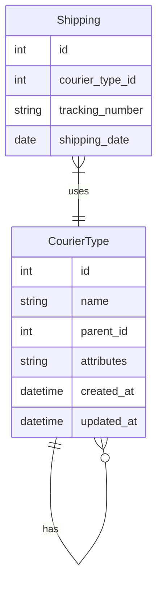

# 母子快递类型管理功能 PRD

## 状态: 草稿

## 简介

本 PRD 定义了在现有快递管理系统中实现"母子快递类型"功能的需求。该功能允许用户为现有的快递类型（如ゆうパケット）创建子类型（如ゆうパケット (1CM)），并能自动统计子类型数量之和作为母类型的总数，同时保留单独编辑母类型的能力。此功能还将在发货记录中实现类似的数据汇总机制，即母快递类型的发货记录包含自身直接记录的数据和所有子类型发货记录的数据之和。此功能将提高系统的数据管理灵活性和统计能力。

## 目标和背景

本功能旨在解决快递类型的层级管理和数据统计需求，主要目标包括：

- 支持创建和管理快递类型的层级关系（母类型-子类型）
- 自动汇总子类型数量为母类型总数
- 在发货记录中实现母子类型数据的汇总统计
- 保留独立编辑母类型的能力
- 在现有系统架构和 UI 基础上实现，确保易用性和一致性

成功标准：

- 用户能够创建、编辑和删除子快递类型
- 系统能自动计算并显示母类型的总数（子类型数量之和）
- 发货记录查询能够正确反映母类型（自身记录+子类型记录之和）的统计数据
- 保持 UI/UX 与现有系统一致

## 功能和需求

### 功能性需求

1. **母子类型关系管理**

   - 允许用户为现有快递类型创建子类型
   - 支持多个子类型关联到同一个母类型
   - 支持基本的 CRUD 操作（创建、读取、更新、删除）

2. **数据统计**

   - 自动计算并显示子类型数量之和作为母类型的总数
   - 在发货记录中，母类型的记录包含自身记录和所有子类型记录的统计之和
   - 在相关统计报表和界面中正确反映母子类型的数量关系

3. **类型管理**
   - 母类型可单独编辑，不影响子类型
   - 子类型继承母类型的基本属性
   - 支持按母类型分组显示子类型

### 非功能性需求

1. **性能**

   - 子类型数量统计应实时更新，不影响系统性能
   - 查询返回时间不超过 500ms

2. **可扩展性**

   - 设计应考虑未来可能需要的多级类型层次结构

3. **兼容性**
   - 与现有快递类型管理功能兼容
   - 不破坏现有数据和功能

### 用户体验需求

1. 保持与现有系统 UI/UX 风格一致
2. 母子类型关系应清晰直观
3. 编辑界面应简洁易用

### 集成需求

1. 与现有快递类型管理功能集成
2. 与统计报表系统集成，确保数据一致性

### 测试需求

1. 单元测试：覆盖模型层和服务层的核心功能
2. 集成测试：验证前后端交互
3. UI 测试：验证用户界面功能和易用性

## Epic 故事列表

### Epic 0: 初始设置

- 数据库模式更新：添加支持母子类型关系的表结构

### Epic-1: 后端实现

#### 故事 1: 数据模型设计

需求:

- 更新快递类型数据模型，添加 parent_id 字段支持母子关系
- 实现获取子类型总和的查询功能
- 添加获取母子类型层级关系的服务方法

#### 故事 2: API 端点实现

需求:

- 实现获取所有快递类型（含层级信息）的 API
- 实现创建子类型的 API
- 实现更新子类型的 API
- 实现删除子类型的 API
- 实现获取母类型统计数据的 API

#### 故事 3: 发货记录 API 更新

需求:

- 更新发货记录查询 API，支持母子类型数据汇总
- 实现获取母类型发货统计（包含自身和子类型数据）的功能
- 确保发货记录中母子类型数据的一致性

### Epic-2: 前端实现

#### 故事 1: 数据管理 Hooks 更新

需求:

- 更新`use-courier-types.ts`钩子，添加以下功能：
  - 获取完整的母子类型层级结构数据
  - 获取特定母类型的子类型列表
  - 创建子类型（支持 parent_id）
  - 计算母类型的总数（包含子类型之和）
- 实现新的`use-shipping-hierarchy.ts`钩子，支持：
  - 获取带层级关系的发货记录数据
  - 获取特定母类型的发货统计（自身+子类型之和）
  - 处理和缓存层级数据，提高前端性能

#### 故事 2: 快递类型管理界面更新

需求:

- 更新快递类型列表组件：
  - 使用缩进或树形结构显示母子类型层级关系
  - 母类型旁显示子类型数量和总和
  - 为母类型添加"添加子类型"操作按钮
- 实现新的子类型添加对话框组件：
  - 创建`add-sub-type-dialog.tsx`组件，支持选择母类型
  - 表单中添加 parent_id 字段（可从 URL 或状态获取）
  - 表单验证确保子类型名称唯一
- 更新快递类型编辑界面：
  - 显示当前编辑类型的母子关系信息
  - 如果是子类型，显示其母类型信息
  - 如果是母类型，显示其所有子类型列表

#### 故事 3: 快递类型统计功能更新

需求:

- 更新`courier-type-stats.tsx`组件：
  - 按层级结构显示统计数据
  - 母类型统计包含其自身数据和子类型之和
  - 提供切换按钮，可选择查看"平铺视图"或"层级视图"
- 实现下钻分析功能：
  - 点击母类型可展开查看其子类型详细数据
  - 支持层级折叠/展开以简化视图
- 更新统计图表：
  - 饼图支持显示母子类型数据的层级关系
  - 添加提示信息，说明母类型数据包含子类型之和

#### 故事 4: 发货记录统计功能更新

需求:

- 创建`shipping-hierarchy-view.tsx`组件：
  - 以层级结构显示发货记录数据
  - 区分显示母类型自身记录和子类型汇总
  - 支持按日期筛选层级数据
- 更新发货记录详情页：
  - 如果查看的是母类型，显示其自身和子类型的发货记录
  - 提供"仅查看自身记录"和"包含子类型记录"切换选项

## 技术栈

| 技术         | 版本   | 描述           |
| ------------ | ------ | -------------- |
| React        | >= 19  | 前端核心框架   |
| Next.js      | 15.2.4 | React 应用框架 |
| TypeScript   | >= 5   | 类型系统       |
| Express.js   | 4.18.2 | 后端 Web 框架  |
| MySQL        | >= 8.4 | 关系型数据库   |
| Zustand      | 最新   | 状态管理       |
| Tailwind CSS | 最新   | 样式框架       |
| Shadcn UI    | 最新   | UI 组件库      |

## 项目结构

### 后端更新

```
src/
  ├── controllers/
  │   ├── courierTypeController.js (更新)
  │   └── shippingController.js (更新)
  ├── models/
  │   ├── courierTypeModel.js (更新)
  │   └── shippingModel.js (更新)
  ├── routes/
  │   ├── courierTypeRoutes.js (更新)
  │   └── shippingRoutes.js (更新)
  └── services/
      ├── courierTypeService.js (更新)
      └── shippingService.js (更新)
```

### 前端更新

```
app/
  └── courier-types/
      ├── page.tsx (更新)
      └── [id]/
          └── edit.tsx (更新)
components/
  └── courier-type/
      ├── courier-type-form.tsx (更新)
      ├── courier-type-list.tsx (更新)
      └── add-sub-type-dialog.tsx (新增)
hooks/
  └── use-courier-types.ts (更新)
types/
  └── courier-type.ts (更新)
```

### 数据库更新

```sql
ALTER TABLE courier
ADD COLUMN parent_id INT,
ADD FOREIGN KEY (parent_id) REFERENCES courier_types(id);
```

## PRD 功能后续版本

- 支持多级嵌套类型（子类型的子类型）
- 批量创建和管理子类型功能
- 子类型自定义属性（不继承自母类型）
- 更复杂的统计规则和报表

## 变更日志

| 变更     | 故事 ID | 描述          |
| -------- | ------- | ------------- |
| 初始草稿 | N/A     | 初始 PRD 草稿 |

## 高级架构图



```mermaid
sequenceDiagram
    参与者 User
    参与者 Frontend
    参与者 Backend
    参与者 Database

    User->>Frontend: 请求查看快递类型列表
    Frontend->>Backend: GET /api/courier-types?includeHierarchy=true
    Backend->>Database: 查询带层级关系的快递类型
    Database-->>Backend: 返回类型数据
    Backend->>Backend: 处理数据，计算子类型总和
    Backend-->>Frontend: 返回带层级和统计的类型数据
    Frontend-->>User: 显示层级化的快递类型列表

    User->>Frontend: 查看发货记录统计
    Frontend->>Backend: GET /api/shipping?includeHierarchy=true
    Backend->>Database: 查询发货记录和关联的快递类型
    Database-->>Backend: 返回发货记录数据
    Backend->>Backend: 处理数据，计算母类型发货统计（自身+子类型）
    Backend-->>Frontend: 返回带统计的发货记录数据
    Frontend-->>User: 显示母子类型的发货记录统计

    User->>Frontend: 为母类型添加子类型
    Frontend->>Backend: POST /api/courier-types (parent_id=X)
    Backend->>Database: 插入新的子类型记录
    Database-->>Backend: 返回成功
    Backend-->>Frontend: 返回新创建的子类型
    Frontend-->>User: 更新UI显示新子类型
```

## 假设与风险

### 假设

1. 现有数据模型可以通过简单扩展支持母子关系
2. 现有 UI 组件可以适应层级显示需求
3. 统计逻辑变更不会对性能产生显著影响
4. 发货记录的母子类型数据汇总不会导致业务逻辑冲突

### 风险

1. 数据迁移可能对现有数据造成影响
2. 层级统计可能在大数据量下影响性能
3. 用户可能需要培训以理解新的母子类型概念
4. 发货记录中母子类型数据的双重计算可能导致统计混乱

### 未知事项

1. 现有数据中是否已有隐含的母子类型关系需要迁移
2. 是否需要支持批量操作子类型
3. 报表系统是否需要同步更新以支持新的数据结构
4. 发货记录统计中是否需要区分母类型自身数据和子类型汇总数据
