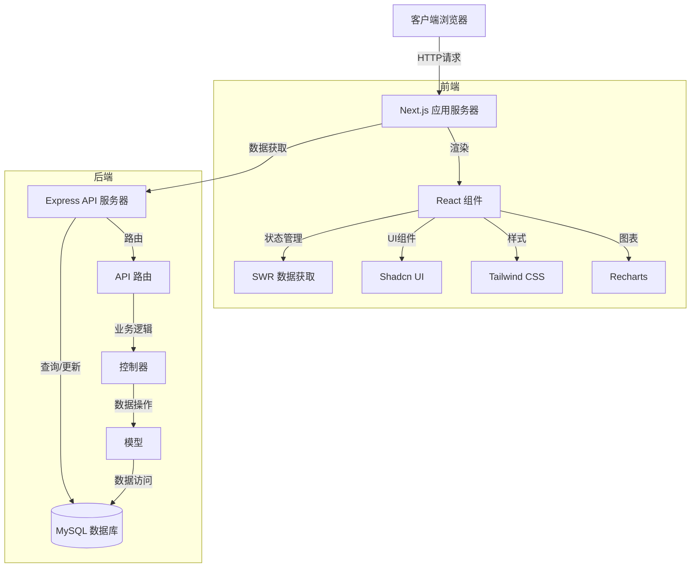
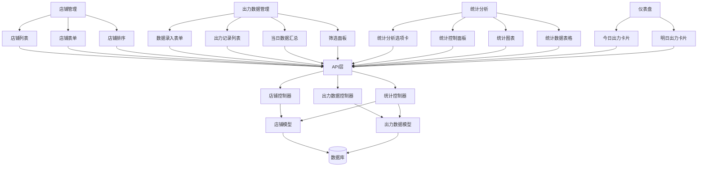
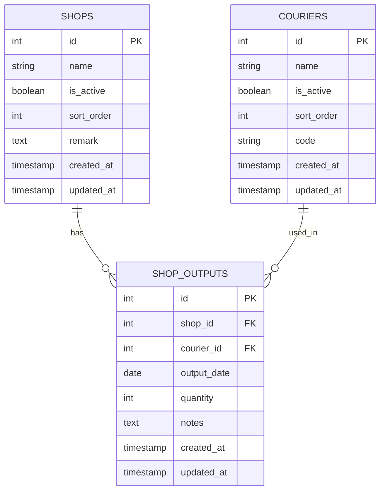
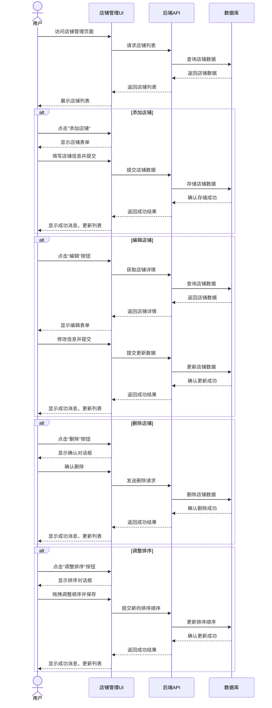
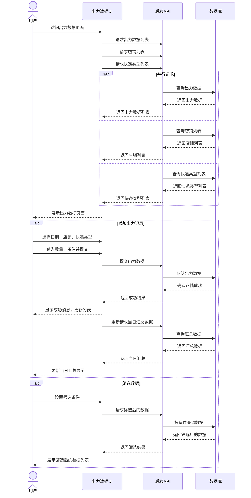

# 店铺出力管理功能架构设计文档

## 状态: Draft

## 1. 技术概述

本文档详细描述了店铺出力管理功能的架构设计，包括系统组件、数据模型、API 设计和前端实现。该功能旨在帮助电商卖家记录并追踪各店铺每日的订单出力情况，包括今天和未来日期的预计出力量。

### 1.1 技术栈

| 技术         | 版本      | 用途                                      |
| ------------ | --------- | ----------------------------------------- |
| Node.js      | >= 22.2.0 | 后端运行时环境                            |
| Express      | 4.18.2    | Web 服务器框架                            |
| MySQL        | >= 8.4.0  | 关系型数据库，用于数据持久化              |
| React        | >= 19.0.0 | 前端 UI 库                                |
| Next.js      | 15.2.4    | React 应用框架，提供服务端渲染和路由      |
| TypeScript   | >= 5.0.0  | 类型检查，提高代码质量和可维护性          |
| Tailwind CSS | 3.4.17    | 用于快速构建响应式 UI 界面                |
| Shadcn UI    | -         | 基于 Radix 的组件系统，提供高质量 UI 组件 |
| Recharts     | 2.15.0    | 基于 React 的图表库，用于数据可视化       |

## 2. 系统架构

### 2.1 整体架构

店铺出力管理功能采用前后端分离的架构模式，通过 RESTful API 进行通信。系统架构如下图所示：



### 2.2 架构特点

1. **分层设计**：前后端明确分离，各层职责清晰
2. **RESTful API**：遵循 REST 原则设计 API 接口
3. **响应式 UI**：基于 React 和 Tailwind CSS 构建自适应界面
4. **数据可视化**：使用 Recharts 提供直观的数据图表展示
5. **缓存策略**：使用 SWR 实现前端数据缓存，提高用户体验
6. **类型安全**：全栈使用 TypeScript 确保类型安全

### 2.3 组件视图



## 3. 数据库设计

### 3.1 数据库模型

#### 3.1.1 shop 表

店铺表存储所有店铺的基本信息。

```sql
CREATE TABLE IF NOT EXISTS shops (
  id INT AUTO_INCREMENT PRIMARY KEY,
  name VARCHAR(255) NOT NULL,
  is_active BOOLEAN DEFAULT true,
  sort_order INT DEFAULT 0,
  remark TEXT,
  created_at TIMESTAMP DEFAULT CURRENT_TIMESTAMP,
  updated_at TIMESTAMP DEFAULT CURRENT_TIMESTAMP ON UPDATE CURRENT_TIMESTAMP
);
```

| 字段名     | 类型         | 约束                                                  | 描述       |
| ---------- | ------------ | ----------------------------------------------------- | ---------- |
| id         | INT          | PRIMARY KEY, AUTO_INCREMENT                           | 主键，自增 |
| name       | VARCHAR(255) | NOT NULL                                              | 店铺名称   |
| is_active  | BOOLEAN      | DEFAULT true                                          | 是否启用   |
| sort_order | INT          | DEFAULT 0                                             | 排序顺序   |
| remark     | TEXT         | NULL 允许                                             | 备注信息   |
| created_at | TIMESTAMP    | DEFAULT CURRENT_TIMESTAMP                             | 创建时间   |
| updated_at | TIMESTAMP    | DEFAULT CURRENT_TIMESTAMP ON UPDATE CURRENT_TIMESTAMP | 更新时间   |

#### 3.1.2 shop_outputs 表

店铺出力数据表存储各店铺的出力记录。

```sql
CREATE TABLE IF NOT EXISTS shop_outputs (
  id INT AUTO_INCREMENT PRIMARY KEY,
  shop_id INT NOT NULL,
  courier_id INT NOT NULL,
  output_date DATE NOT NULL,
  quantity INT NOT NULL,
  notes TEXT,
  created_at TIMESTAMP DEFAULT CURRENT_TIMESTAMP,
  updated_at TIMESTAMP DEFAULT CURRENT_TIMESTAMP ON UPDATE CURRENT_TIMESTAMP,
  FOREIGN KEY (shop_id) REFERENCES shops(id),
  FOREIGN KEY (courier_id) REFERENCES couriers(id)
);
```

| 字段名      | 类型      | 约束                                                  | 描述                        |
| ----------- | --------- | ----------------------------------------------------- | --------------------------- |
| id          | INT       | PRIMARY KEY, AUTO_INCREMENT                           | 主键，自增                  |
| shop_id     | INT       | NOT NULL, FOREIGN KEY                                 | 外键，关联 shops 表的 id    |
| courier_id  | INT       | NOT NULL, FOREIGN KEY                                 | 外键，关联 couriers 表的 id |
| output_date | DATE      | NOT NULL                                              | 出力日期                    |
| quantity    | INT       | NOT NULL                                              | 出力数量                    |
| notes       | TEXT      | NULL 允许                                             | 备注信息                    |
| created_at  | TIMESTAMP | DEFAULT CURRENT_TIMESTAMP                             | 创建时间                    |
| updated_at  | TIMESTAMP | DEFAULT CURRENT_TIMESTAMP ON UPDATE CURRENT_TIMESTAMP | 更新时间                    |

### 3.2 索引设计

为提高查询性能，我们在以下字段上创建索引：

```sql
-- shop_outputs表索引
CREATE INDEX idx_shop_outputs_date ON shop_outputs(output_date);
CREATE INDEX idx_shop_outputs_shop_id ON shop_outputs(shop_id);
CREATE INDEX idx_shop_outputs_courier_id ON shop_outputs(courier_id);
CREATE INDEX idx_shop_outputs_composite_1 ON shop_outputs(shop_id, courier_id, output_date);
CREATE INDEX idx_shop_outputs_composite_2 ON shop_outputs(output_date, shop_id);

-- shops表索引
CREATE INDEX idx_shops_is_active ON shops(is_active);
CREATE INDEX idx_shops_sort_order ON shops(sort_order);
```

### 3.3 实体关系图



### 3.4 数据库关系

- **shops 表与 shop_outputs 表**：一对多关系，一个店铺可以有多条出力记录
- **couriers 表与 shop_outputs 表**：一对多关系，一个快递类型可以有多条出力记录

## 4. API 设计

### 4.1 店铺管理 API

| 接口路径              | 方法   | 描述             | 请求参数                               | 响应结果                        |
| --------------------- | ------ | ---------------- | -------------------------------------- | ------------------------------- |
| /api/shops            | GET    | 获取店铺列表     | ?is_active=true&search=xx&sort_by=name | { success, data: [shop1, ...] } |
| /api/shops/:id        | GET    | 获取单个店铺     | id                                     | { success, data: shop }         |
| /api/shops            | POST   | 创建店铺         | { name, remark, is_active }            | { success, data: { id, ... } }  |
| /api/shops/:id        | PUT    | 更新店铺         | { name, remark, is_active }            | { success, data: shop }         |
| /api/shops/:id        | DELETE | 删除店铺         | id                                     | { success, message }            |
| /api/shops/sort       | POST   | 更新店铺排序     | [{ id, sort_order }, ...]              | { success, message }            |
| /api/shops/:id/toggle | POST   | 切换店铺活跃状态 | id                                     | { success, data: shop }         |

#### 请求/响应示例

**获取店铺列表**

```
GET /api/shops?is_active=true&search=京东&sort_by=name

响应:
{
  "success": true,
  "data": [
    {
      "id": 1,
      "name": "京东店",
      "is_active": true,
      "sort_order": 2,
      "remark": "京东官方旗舰店",
      "created_at": "2023-05-15T08:00:00Z",
      "updated_at": "2023-05-15T08:00:00Z"
    },
    ...
  ]
}
```

**创建店铺**

```
POST /api/shops
{
  "name": "拼多多店",
  "remark": "拼多多旗舰店",
  "is_active": true
}

响应:
{
  "success": true,
  "data": {
    "id": 3,
    "name": "拼多多店",
    "remark": "拼多多旗舰店",
    "is_active": true,
    "sort_order": 3,
    "created_at": "2023-05-15T10:30:00Z",
    "updated_at": "2023-05-15T10:30:00Z"
  }
}
```

### 4.2 店铺出力数据 API

| 接口路径                 | 方法   | 描述                   | 请求参数                                              | 响应结果                             |
| ------------------------ | ------ | ---------------------- | ----------------------------------------------------- | ------------------------------------ |
| /api/shop-outputs        | GET    | 获取出力数据列表       | ?date=&shop_id=&courier_id=&page=&per_page=           | { success, data, total, page_count } |
| /api/shop-outputs/:id    | GET    | 获取单条出力记录       | id                                                    | { success, data: output }            |
| /api/shop-outputs        | POST   | 创建出力记录           | { shop_id, courier_id, output_date, quantity, notes } | { success, data: { id, ... } }       |
| /api/shop-outputs/:id    | PUT    | 更新出力记录           | { shop_id, courier_id, output_date, quantity, notes } | { success, data: output }            |
| /api/shop-outputs/:id    | DELETE | 删除出力记录           | id                                                    | { success, message }                 |
| /api/shop-outputs/recent | GET    | 获取最近录入的出力数据 | ?limit=10                                             | { success, data: [output1, ...] }    |
| /api/shop-outputs/today  | GET    | 获取今日出力数据       | -                                                     | { success, data: [output1, ...] }    |

#### 请求/响应示例

**获取出力数据列表**

```
GET /api/shop-outputs?date=2023-05-15&shop_id=1&page=1&per_page=10

响应:
{
  "success": true,
  "data": [
    {
      "id": 1,
      "shop_id": 1,
      "shop_name": "京东店",
      "courier_id": 2,
      "courier_name": "顺丰",
      "output_date": "2023-05-15",
      "quantity": 85,
      "notes": "大促销活动",
      "created_at": "2023-05-15T08:00:00Z",
      "updated_at": "2023-05-15T08:00:00Z"
    },
    ...
  ],
  "total": 24,
  "page_count": 3
}
```

**创建出力记录**

```
POST /api/shop-outputs
{
  "shop_id": 1,
  "courier_id": 2,
  "output_date": "2023-05-16",
  "quantity": 50,
  "notes": "预计明日发货"
}

响应:
{
  "success": true,
  "data": {
    "id": 25,
    "shop_id": 1,
    "shop_name": "京东店",
    "courier_id": 2,
    "courier_name": "顺丰",
    "output_date": "2023-05-16",
    "quantity": 50,
    "notes": "预计明日发货",
    "created_at": "2023-05-15T14:30:00Z",
    "updated_at": "2023-05-15T14:30:00Z"
  }
}
```

### 4.3 统计分析 API

| 接口路径                             | 方法 | 描述                   | 请求参数                                  | 响应结果                                |
| ------------------------------------ | ---- | ---------------------- | ----------------------------------------- | --------------------------------------- |
| /api/stats/shop-outputs/shops        | GET  | 按店铺统计出力数据     | ?date_from=&date_to=&courier_id=          | { success, data: [stat1, ...] }         |
| /api/stats/shop-outputs/couriers     | GET  | 按快递类型统计出力数据 | ?date_from=&date_to=&shop_id=             | { success, data: [stat1, ...] }         |
| /api/stats/shop-outputs/dates        | GET  | 按日期统计出力数据     | ?date_from=&date_to=&shop_id=&courier_id= | { success, data: [stat1, ...] }         |
| /api/stats/shop-outputs/total        | GET  | 获取总计数据           | ?date_from=&date_to=                      | { success, data: { total, ... } }       |
| /api/dashboard/shop-outputs/today    | GET  | 获取今日出力概览       | -                                         | { success, data: { total, shops: [] } } |
| /api/dashboard/shop-outputs/tomorrow | GET  | 获取明日出力预测       | -                                         | { success, data: { total, shops: [] } } |

#### 请求/响应示例

**按店铺统计出力数据**

```
GET /api/stats/shop-outputs/shops?date_from=2023-05-01&date_to=2023-05-31

响应:
{
  "success": true,
  "data": [
    {
      "shop_id": 1,
      "shop_name": "京东店",
      "total_quantity": 2500,
      "percentage": 42.5,
      "daily_average": 80.6,
      "details": [
        {
          "courier_id": 1,
          "courier_name": "韵达",
          "quantity": 1200
        },
        {
          "courier_id": 2,
          "courier_name": "顺丰",
          "quantity": 1300
        }
      ]
    },
    ...
  ]
}
```

**获取今日出力概览**

```
GET /api/dashboard/shop-outputs/today

响应:
{
  "success": true,
  "data": {
    "total": 285,
    "shops": [
      {
        "shop_id": 1,
        "shop_name": "淘宝店",
        "value": 125,
        "percent": "44%"
      },
      {
        "shop_id": 2,
        "shop_name": "京东店",
        "value": 95,
        "percent": "33%"
      },
      {
        "shop_id": 3,
        "shop_name": "拼多多店",
        "value": 65,
        "percent": "23%"
      }
    ]
  }
}
```

## 5. 前端实现

### 5.1 前端目录结构

```
frontend/
├── app/
│   ├── output-data/
│   │   ├── page.tsx                   # 出力数据页面
│   │   └── components/                # 出力数据页面专用组件
│   │       ├── OutputForm.tsx         # 出力数据录入表单
│   │       ├── OutputList.tsx         # 出力记录列表
│   │       ├── OutputSummary.tsx      # 出力数据汇总
│   │       └── FilterPanel.tsx        # 筛选和搜索面板
│   ├── courier-types/
│   │   ├── page.tsx                   # 快递类型与店铺管理页面
│   │   └── components/                # 页面专用组件
│   │       ├── TypeManagementTab.tsx  # 快递类型管理标签页
│   │       └── ShopManagementTab.tsx  # 店铺管理标签页
│   ├── stats/
│   │   ├── page.tsx                   # 统计分析页面
│   │   └── components/                # 统计分析组件
│   │       ├── ShopOutputStats.tsx    # 出力数据统计组件
│   │       ├── StatsControl.tsx       # 统计控制面板
│   │       ├── StatsChart.tsx         # 统计图表
│   │       └── StatsTable.tsx         # 统计数据表格
│   └── dashboard/
│       ├── page.tsx                   # 仪表盘页面
│       └── components/                # 仪表盘组件
│           ├── TodayOutputCard.tsx    # 今日出力卡片
│           └── TomorrowOutputCard.tsx # 明日出力卡片
├── components/
│   ├── shop/                          # 店铺相关组件
│   │   ├── ShopForm.tsx               # 店铺表单组件
│   │   ├── ShopList.tsx               # 店铺列表组件
│   │   └── ShopSortModal.tsx          # 店铺排序模态框
│   ├── shop-output/                   # 出力数据相关通用组件
│   │   ├── DateSelector.tsx           # 日期选择器(今天/明天)
│   │   └── ShopSelector.tsx           # 店铺选择器
│   └── ui/                            # UI组件库
│       ├── ...                        # 通用UI组件
└── lib/
    ├── types/                         # 类型定义
    │   ├── shop.ts                    # 店铺相关类型
    │   └── shop-output.ts             # 出力数据相关类型
    ├── api/                           # API封装
    │   ├── shop.ts                    # 店铺API
    │   └── shop-output.ts             # 出力数据API
    └── utils/                         # 工具函数
        ├── date.ts                    # 日期相关工具
        └── format.ts                  # 格式化工具
```

### 5.2 核心页面流程

#### 5.2.1 店铺管理流程



#### 5.2.2 出力数据管理流程



### 5.3 关键组件设计

#### 5.3.1 出力数据录入表单

```tsx
// OutputForm.tsx
interface OutputFormProps {
  onSubmit: (data: ShopOutputFormData) => Promise<void>;
  shopsList: Shop[];
  couriersList: Courier[];
}

interface ShopOutputFormData {
  output_date: string;
  shop_id: number;
  courier_id: number;
  quantity: number;
  notes?: string;
}

export function OutputForm({
  onSubmit,
  shopsList,
  couriersList,
}: OutputFormProps) {
  // 组件实现...
}
```

#### 5.3.2 今日出力卡片

```tsx
// TodayOutputCard.tsx
interface TodayOutputCardProps {
  data?: {
    total: number;
    shops: {
      shop_id: string;
      shop_name: string;
      value: number;
      percent: string;
    }[];
  };
  loading?: boolean;
}

export function TodayOutputCard({ data, loading }: TodayOutputCardProps) {
  // 组件实现...
}
```

#### 5.3.3 店铺管理标签页

```tsx
// ShopManagementTab.tsx
export function ShopManagementTab() {
  // 状态和钩子...
  // 组件实现...
}
```

### 5.4 状态管理与数据获取

项目使用 SWR 库进行数据获取和状态管理，以下是核心 hooks 示例：

```tsx
// hooks/useShops.ts
export function useShops(params?: { isActive?: boolean; search?: string }) {
  const { data, error, mutate } = useSWR(
    `/api/shops${
      params ? `?${new URLSearchParams(params as any).toString()}` : ""
    }`,
    fetcher
  );

  return {
    shops: data?.data || [],
    isLoading: !error && !data,
    isError: error,
    mutate,
  };
}

// hooks/useShopOutputs.ts
export function useShopOutputs(params?: {
  date?: string;
  shop_id?: number;
  courier_id?: number;
  page?: number;
  per_page?: number;
}) {
  const { data, error, mutate } = useSWR(
    `/api/shop-outputs${
      params ? `?${new URLSearchParams(params as any).toString()}` : ""
    }`,
    fetcher
  );

  return {
    outputs: data?.data || [],
    total: data?.total || 0,
    pageCount: data?.page_count || 0,
    isLoading: !error && !data,
    isError: error,
    mutate,
  };
}

// hooks/useDashboardOutputs.ts
export function useDashboardOutputs() {
  const { data: todayData, error: todayError } = useSWR(
    "/api/dashboard/shop-outputs/today",
    fetcher
  );
  const { data: tomorrowData, error: tomorrowError } = useSWR(
    "/api/dashboard/shop-outputs/tomorrow",
    fetcher
  );

  return {
    today: todayData?.data,
    tomorrow: tomorrowData?.data,
    isLoading: (!todayData && !todayError) || (!tomorrowData && !tomorrowError),
    isError: todayError || tomorrowError,
  };
}
```

## 6. 后端实现

### 6.1 控制器设计

#### 6.1.1 店铺控制器

```javascript
// shopController.js
const Shop = require("../models/Shop");

// 获取店铺列表
exports.getShops = async (req, res) => {
  try {
    const { is_active, search, sort_by = "sort_order" } = req.query;

    // 构建查询条件
    const query = {};
    if (is_active !== undefined) {
      query.is_active = is_active === "true";
    }
    if (search) {
      query.name = { $regex: search, $options: "i" };
    }

    // 执行查询
    const shops = await Shop.find(query).sort({ [sort_by]: 1 });

    res.json({ success: true, data: shops });
  } catch (error) {
    console.error("获取店铺列表出错:", error);
    res.status(500).json({ success: false, message: "服务器错误" });
  }
};

// 其他控制器方法...
```

#### 6.1.2 出力数据控制器

```javascript
// shopOutputController.js
const ShopOutput = require("../models/ShopOutput");
const Shop = require("../models/Shop");
const Courier = require("../models/Courier");

// 获取出力数据列表
exports.getShopOutputs = async (req, res) => {
  try {
    const { date, shop_id, courier_id, page = 1, per_page = 10 } = req.query;

    // 构建查询条件
    const query = {};
    if (date) {
      query.output_date = date;
    }
    if (shop_id) {
      query.shop_id = shop_id;
    }
    if (courier_id) {
      query.courier_id = courier_id;
    }

    // 计算分页
    const skip = (page - 1) * per_page;

    // 执行查询
    const outputs = await ShopOutput.find(query)
      .populate("shop_id", "name")
      .populate("courier_id", "name")
      .sort({ output_date: -1, created_at: -1 })
      .skip(skip)
      .limit(parseInt(per_page));

    // 获取总数
    const total = await ShopOutput.countDocuments(query);
    const pageCount = Math.ceil(total / per_page);

    // 转换为前端友好格式
    const data = outputs.map((output) => ({
      id: output._id,
      shop_id: output.shop_id._id,
      shop_name: output.shop_id.name,
      courier_id: output.courier_id._id,
      courier_name: output.courier_id.name,
      output_date: output.output_date,
      quantity: output.quantity,
      notes: output.notes,
      created_at: output.created_at,
      updated_at: output.updated_at,
    }));

    res.json({
      success: true,
      data,
      total,
      page_count: pageCount,
    });
  } catch (error) {
    console.error("获取出力数据列表出错:", error);
    res.status(500).json({ success: false, message: "服务器错误" });
  }
};

// 其他控制器方法...
```

#### 6.1.3 统计控制器

```javascript
// statsController.js
const ShopOutput = require('../models/ShopOutput');

// 按店铺统计
exports.getShopStats = async (req, res) => {
  try {
    const { date_from, date_to, courier_id } = req.query;

    // 构建查询条件
    const query = {};
    if (date_from || date_to) {
      query.output_date = {};
      if (date_from) {
        query.output_date.$gte = date_from;
      }
      if (date_to) {
        query.output_date.$lte = date_to;
      }
    }
    if (courier_id) {
      query.courier_id = courier_id;
    }

    // 执行聚合查询
    const stats = await ShopOutput.aggregate([
      { $match: query },
      { $lookup: { from: 'shops', localField: 'shop_id', foreignField: '_id', as: 'shop' } },
      { $unwind: '$shop' },
      {
        $group: {
          _id: '$shop_id',
          shop_name: { $first: '$shop.name' },
          total_quantity: { $sum: '$quantity' },
          details: {
            $push: {
              courier_id: '$courier_id',
              quantity: '$quantity'
            }
          }
        }
      },
      { $sort: { total_quantity: -1 } }
    ]);

    // 计算总量和百分比
    const totalOutput = stats.reduce((sum, item) => sum + item.total_quantity, 0);

    // 处理结果
    const result = await Promise.all(stats.map(async (item) => {
      // 获取详情中的快递名称
      const details = await Promise.all(item.details.map(async (detail) => {
        const courier = await Courier.findById(detail.courier_id);
        return {
          courier_id: detail.courier_id,
          courier_name: courier ? courier.name : '未知',
          quantity: detail.quantity
        };
      }));

      // 合并相同快递类型的数据
      const mergedDetails = Object.values(details.reduce((acc, curr) => {
        if (!acc[curr.courier_id]) {
          acc[curr.courier_id] = curr;
        } else {
          acc[curr.courier_id].quantity += curr.quantity;
        }
        return acc;
      }, {}));

      // 计算日均
      const days = date_from && date_to
        ? Math.max(1, Math.ceil((new Date(date_to) - new Date(date_from)) / (1000 * 60 * 60 * 24)));
      const daily_average = totalOutput / days;

      return {
        shop_id: item._id,
        shop_name: item.shop_name,
        total_quantity: item.total_quantity,
        percentage: (item.total_quantity / totalOutput) * 100,
        daily_average,
        details: mergedDetails
      };
    }));

    res.json({ success: true, data: result });
  } catch (error) {
    console.error('获取店铺统计数据出错:', error);
    res.status(500).json({ success: false, message: '服务器错误' });
  }
};
```

### 6.2 模型设计

#### Shop 模型

```javascript
// Shop.js
const mongoose = require("mongoose");

const shopSchema = new mongoose.Schema(
  {
    name: {
      type: String,
      required: true,
      trim: true,
    },
    is_active: {
      type: Boolean,
      default: true,
    },
    sort_order: {
      type: Number,
      default: 0,
    },
    remark: {
      type: String,
      trim: true,
    },
  },
  {
    timestamps: {
      createdAt: "created_at",
      updatedAt: "updated_at",
    },
  }
);

module.exports = mongoose.model("Shop", shopSchema);
```

#### ShopOutput 模型

```javascript
// ShopOutput.js
const mongoose = require("mongoose");

const shopOutputSchema = new mongoose.Schema(
  {
    shop_id: {
      type: mongoose.Schema.Types.ObjectId,
      ref: "Shop",
      required: true,
    },
    courier_id: {
      type: mongoose.Schema.Types.ObjectId,
      ref: "Courier",
      required: true,
    },
    output_date: {
      type: Date,
      required: true,
    },
    quantity: {
      type: Number,
      required: true,
      min: 0,
    },
    notes: {
      type: String,
      trim: true,
    },
  },
  {
    timestamps: {
      createdAt: "created_at",
      updatedAt: "updated_at",
    },
  }
);

// 复合索引
shopOutputSchema.index({ shop_id: 1, courier_id: 1, output_date: 1 });
shopOutputSchema.index({ output_date: 1 });
shopOutputSchema.index({ shop_id: 1 });
shopOutputSchema.index({ courier_id: 1 });

module.exports = mongoose.model("ShopOutput", shopOutputSchema);
```

## 7. 性能优化与安全考虑

### 7.1 性能优化

1. **数据库索引优化**

   - 为频繁查询的字段创建索引
   - 使用复合索引优化多字段查询
   - 避免过度索引，只索引必要字段

2. **API 响应优化**

   - 实现分页机制，避免一次性返回大量数据
   - 支持按需加载，只返回必要字段
   - 使用数据压缩减少传输量
   - 实现合理的缓存策略

3. **前端优化**
   - 使用 SWR 进行数据缓存和状态管理
   - 实现懒加载和分页加载
   - 组件按需加载
   - 图表数据本地聚合，减少服务器压力

### 7.2 安全考虑

1. **输入验证**

   - 前后端同时验证所有用户输入
   - 防止 SQL 注入和 XSS 攻击
   - 使用参数化查询

2. **权限控制**

   - 实现基于角色的访问控制
   - API 访问需要身份验证
   - 敏感操作需要二次确认

3. **数据保护**
   - 敏感数据传输加密
   - 定期备份数据
   - 遵循最小权限原则

## 8. 测试策略

### 8.1 单元测试

- 使用 Jest 框架进行单元测试
- 针对各控制器方法编写测试用例
- 使用模拟对象隔离外部依赖

### 8.2 集成测试

- 测试 API 端点的完整功能
- 验证数据流和业务规则
- 测试多个组件的协同工作

### 8.3 前端测试

- 使用 React Testing Library 测试组件渲染
- 测试用户交互和状态更新
- 测试表单验证和错误处理

### 8.4 性能测试

- 测试系统在高负载下的响应能力
- 识别性能瓶颈
- 验证优化措施的有效性

## 9. 部署与维护

### 9.1 部署策略

- 使用 CI/CD 流程自动化部署
- 采用蓝绿部署或金丝雀发布减少风险
- 环境配置使用环境变量，避免硬编码

### 9.2 监控与日志

- 实现集中式日志收集
- 设置关键指标监控
- 配置异常警报机制
- 定期审查性能指标

### 9.3 备份策略

- 定期自动备份数据库
- 实现时间点恢复能力
- 测试恢复流程

## 10. 变更日志

| 版本 | 日期       | 变更描述     | 作者 |
| ---- | ---------- | ------------ | ---- |
| 0.1  | 2023-05-15 | 架构文档初稿 | AI   |

## 11. 附录

### 11.1 名词解释

- **店铺**：用户在各电商平台开设的在线商店
- **出力**：指每天店铺的订单发货量
- **快递类型**：不同的快递公司或物流方式

### 11.2 参考文档

- [Express.js 文档](https://expressjs.com/)
- [Next.js 文档](https://nextjs.org/docs)
- [MySQL 文档](https://dev.mysql.com/doc/)
- [Recharts 文档](https://recharts.org/)
